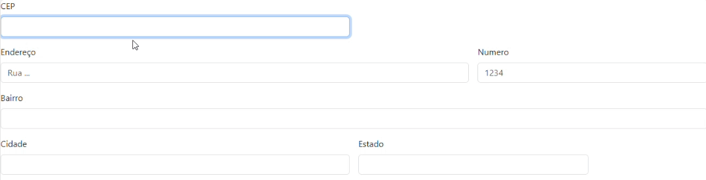

# 🙃 Cadastro-de-Endereco

## 📋 descrição

Projeto feito para diciplina de programação web, no intuito de criar um formulario para [cadastro de endereço.](https://emillycaaroline.github.io/Projeto-CadEndereco/).

## 🔧 Funcionalidades

- Este projeto se trata de uma pagina para cadastro de endereço onde através so CEP puxa endereço.
- Ele através do CEP colocado nos tras dados como RUA, BAIRRO, CIDADE E ESTADO.
- Também sendo uma página responsiva que se adapta a qualquer tipo de tela.
- Fizemos a tradução para português e apagamos campos desnecessários.
- Usamos o site [viaCep](https://viacep.com.br/) para puxar os dados do CEP usando a função json.
- Usamos `addEventListener()` do JavaScript permite que você configure funções a serem chamadas quando um evento específico acontece.
- Usamos `await` recebe uma Promise e a transforma em um valor de retorno.
- Usamos `async()` significa que o valor de retorno da função será, "por baixo dos panos".

### 🛠️ Tecnologias Utilizadas
    
   - `github`  
   - `README`
   - `HTML5`
   - [`Bootstrap 5`](https://getbootstrap.com/)

## 🖇️ Fontes consultadas

[Bootstrap 5: Para fazer o html.](https://getbootstrap.com/docs/5.0/forms/layout/#gutters)
[Via cep: Para consulta dos dados do cep](https://viacep.com.br/)

## 👀 Funcionando

✅`Quando o cep for colocado corretamente: ele irá puxar os dados do endereço`

❌`Quando o cep estiver errado com numeros a menos ou a mais:`

## ✒️ Autores

[ Emilly Caroline ](https://github.com/emillycaaroline)   

ORIENTAÇÃO: 
[ Leonardo Rocha ](https://github.com/LeonardoRochaMarista)|[ Larissa Manrique](https://github.com/larissassk)|[ Vitória Gabrieli ](https://github.com/vickieww) 
|:---:|:---:|:---:|

